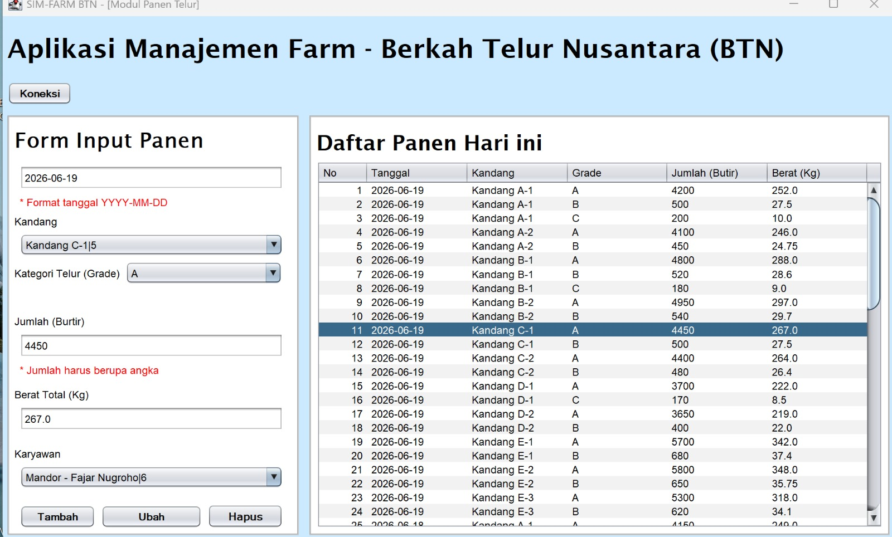
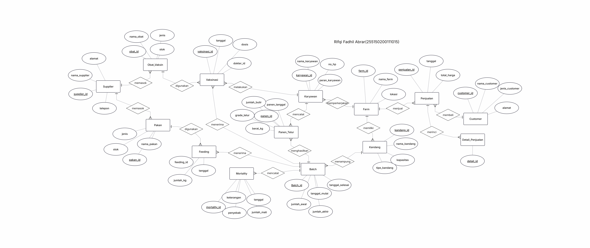
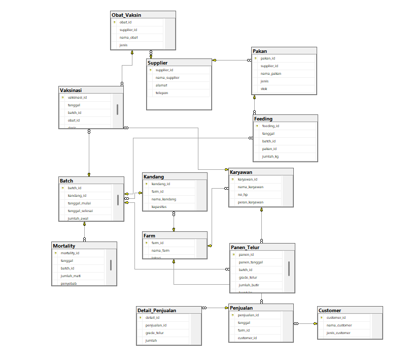

# Sistem Informasi Manajemen Berkah Telur Nusantara (SIM-FarmBTN)

SIM-FarmBTN adalah aplikasi manajemen operasional peternakan ayam petelur milik **Berkah Telur Nusantara (BTN)**. Project ini terdiri dari implementasi database fisik (DDL, DML, Trigger, Function, dan Stored Procedure pada SQL Server) serta aplikasi antarmuka Desktop berbasis Java Swing (JDBC) untuk mengelola data panen telur secara terintegrasi.



---

## 📌 Daftar Isi
1. [Fitur Utama](#-fitur-utama)
2. [Arsitektur Database](#%EF%B8%8F-arsitektur-database)
3. [Prasyarat Sistem](#-prasyarat-sistem)
4. [Langkah-Langkah Instalasi & Setup](#-langkah-langkah-instalasi--setup)
   - [A. Setup Database (SQL Server)](#a-setup-database-sql-server)
   - [B. Konfigurasi Projek Java](#b-konfigurasi-projek-java)
5. [Panduan Pengujian (Testing)](#-panduan-pengujian-testing)
   - [1. Pengujian Aplikasi Java Swing](#1-pengujian-aplikasi-java-swing)
   - [2. Pengujian Triggers di Database](#2-pengujian-triggers-di-database)
   - [3. Pengujian Function (`fn_MortalityRate`)](#3-pengujian-function-fn_mortalityrate)
   - [4. Pengujian Stored Procedure (`sp_GetLaporanKinerjaFarm`)](#4-pengujian-stored-procedure-sp_getlaporankinerjafarm)
6. [Penjelasan Struktur Kode & File](#-penjelasan-struktur-kode--file)

---

## 🚀 Fitur Utama

- **Koneksi Database Cepat:** Dilengkapi dengan tombol pengujian koneksi JDBC langsung dari GUI Java Swing ke SQL Server.
- **Manajemen Data Panen Telur (CRUD):** Tambah, lihat, ubah, dan hapus data hasil panen telur harian secara real-time.
- **Validasi Input Otomatis:** Memvalidasi tipe data angka pada jumlah butir dan berat telur, serta membatasi pemilihan data yang valid melalui dropdown ComboBox (Kandang, Karyawan, Grade Telur).
- **Automasi Database (Triggers):**
  - Pengurangan populasi ayam secara otomatis jika terjadi kematian (`Mortality`).
  - Pengurangan stok pakan secara otomatis setiap pemberian pakan dilakukan (`Feeding`).
- **Analisis Kinerja & Pelaporan:**
  - Fungsi untuk menghitung tingkat mortalitas (`fn_MortalityRate`).
  - Stored Procedure untuk menghasilkan laporan produktivitas telur, konsumsi pakan, dan tingkat mortalitas per farm pada rentang tanggal tertentu (`sp_GetLaporanKinerjaFarm`).

---

## 🛠️ Arsitektur Database

Database **SIM_FARM_BTN** dirancang dengan integritas data yang ketat melalui penggunaan *Primary Key*, *Foreign Key*, *Check Constraints*, *Unique Constraints*, dan *Default Values*. Berikut adalah entitas utama yang diimplementasikan dalam skrip SQL:

1. **Farm:** Informasi lokasi peternakan utama.
2. **Kandang:** Kapasitas dan tipe kandang (Baterai, Lantai, Koloni).
3. **Batch:** Siklus masa produktif ayam per kandang.
4. **Karyawan:** Pencatatan staf beserta peran kerjanya (Manajer, Mandor, Pekerja, Dokter Hewan).
5. **Supplier, Pakan, & Obat_Vaksin:** Manajemen logistik stok pakan dan kesehatan hewan.
6. **Feeding, Panen_Telur, & Mortality:** Transaksi aktivitas harian peternakan ayam.
7. **Vaksinasi:** Log riwayat tindakan medis terhadap ayam oleh Dokter Hewan.
8. **Customer, Penjualan, & Detail_Penjualan:** Alur transaksi komersial hasil panen telur ke konsumen.

### 📊 Diagram Arsitektur

#### Entity Relationship Diagram (ERD)


#### Tabel Relasional (Relational Table)


---

## 💻 Prasyarat Sistem

Sebelum menjalankan aplikasi, pastikan komputer Anda telah terinstal:
1. **Java Development Kit (JDK)** versi 8 atau yang lebih baru.
2. **Microsoft SQL Server** (Express / Developer Edition).
3. **SQL Server Management Studio (SSMS)** atau ekstensi database editor lainnya.
4. **JDBC Driver untuk SQL Server** (`mssql-jdbc` jar).
5. IDE Java seperti **NetBeans / Eclipse / IntelliJ IDEA** (opsional, projek dikonfigurasi menggunakan struktur Ant).

---

## 📥 Langkah-Langkah Instalasi & Setup

### A. Setup Database (SQL Server)
1. Buka **SQL Server Management Studio (SSMS)**.
2. Hubungkan ke server database Anda (misalnya `localhost` atau `.` menggunakan SQL Server Authentication atau Windows Authentication).
3. Buka file skrip SQL yang disediakan:
   `SIM_FARM_BTN_Tahap2_Tahap3_Lengkap_raditya rafa_rayhan.sql`
4. Jalankan (Execute / klik `F5`) skrip tersebut secara keseluruhan. Skrip dirancang secara *idempotent* (akan menghapus database lama jika ada lalu membuatnya kembali, membuat tabel, trigger, function, procedure, dan memasukkan data dummy pengujian).

### B. Konfigurasi Projek Java
1. Buka projek **SIM-FarmBTN_Apps** menggunakan NetBeans IDE Anda.
2. Pastikan file Driver JDBC (`mssql-jdbc-*.jar`) sudah ditambahkan ke dalam **Libraries** projek.
3. Buka berkas [Form_InputTelur.java](file:///D:/projects_vsssl/java_kuliah_2/BASDAT/FARM-BTN/SIM-FarmBTN_Apps/src/sim/farmbtn_apps/Form_InputTelur.java).
4. Periksa baris berikut untuk menyesuaikan kredensial login SQL Server Anda:
   ```java
   private static final String DB_URL = "jdbc:sqlserver://localhost:1433;databaseName=SIM_FARM_BTN;encrypt=true;trustServerCertificate=true;";
   private static final String DB_USER = "sa"; // Ubah dengan user SQL Server Anda
   private static final String DB_PASS = "admin1234"; // Ubah dengan password SQL Server Anda
   ```
5. Simpan dan lakukan *Build* projek.

---

## 🧪 Panduan Pengujian (Testing)

### 1. Pengujian Aplikasi Java Swing
Jalankan aplikasi Java Swing ([Form_InputTelur.java](file:///D:/projects_vsssl/java_kuliah_2/BASDAT/FARM-BTN/SIM-FarmBTN_Apps/src/sim/farmbtn_apps/Form_InputTelur.java)) dan lakukan skenario pengujian berikut:

- **Uji Koneksi Database:**
  1. Klik tombol **Koneksi** di bagian atas form.
  2. Sistem akan menampilkan dialog pesan: `"Koneksi Database Berhasil!"`.
  3. Setelah itu, tabel data panen akan terisi secara otomatis dengan data dari SQL Server, dan pilihan dropdown Kandang serta Karyawan akan dimuat.

- **Uji Insert (Tambah Data):**
  1. Isi field **Tanggal** dengan format `YYYY-MM-DD` (Contoh: `2026-06-21`).
  2. Pilih **Kandang** dan **Karyawan** dari ComboBox.
  3. Pilih **Grade Telur** (Contoh: `A`).
  4. Masukkan **Jumlah Butir** (Contoh: `150`) dan **Berat (Kg)** (Contoh: `9.5`).
  5. Klik tombol **Add**.
  6. Dialog `"Data Panen Berhasil Ditambahkan!"` akan muncul dan data baru langsung masuk ke baris tabel.

- **Uji Update (Ubah Data):**
  1. Pilih salah satu baris data pada tabel. Data tersebut akan otomatis mengisi input form.
  2. Ubah nilai input tertentu (misal **Jumlah Butir** menjadi `200`).
  3. Klik tombol **Update**.
  4. Dialog `"Data Panen Berhasil Diubah!"` akan muncul dan tampilan tabel ter-update.

- **Uji Delete (Hapus Data):**
  1. Pilih baris data yang ingin dihapus pada tabel.
  2. Klik tombol **Delete**.
  3. Klik **Yes** pada dialog konfirmasi `"Yakin hapus data panen ini?"`.
  4. Dialog `"Data berhasil dihapus!"` muncul dan data hilang dari tabel.

---

### 2. Pengujian Triggers di Database
Pengujian dilakukan di SSMS dengan mengeksekusi perintah SQL untuk memastikan otomasi database bekerja:

- **Trigger 1: `trg_KurangiPopulasi` (Tabel `Mortality`)**
  *Deskripsi:* Mengurangi populasi aktif (`jumlah_sekarang`) pada tabel `Batch` secara otomatis ketika ada ayam mati yang diinput ke tabel `Mortality`.
  *Langkah Pengujian:*
  ```sql
  -- 1. Cek populasi batch sebelum ada kematian (misal batch_id = 1)
  SELECT batch_id, jumlah_sekarang FROM Batch WHERE batch_id = 1;

  -- 2. Input data kematian baru pada batch_id = 1
  INSERT INTO Mortality (tanggal, batch_id, jumlah_mati, penyebab)
  VALUES ('2026-06-21', 1, 10, 'Sakit');

  -- 3. Cek kembali populasi batch_id = 1 (harus berkurang sebanyak 10)
  SELECT batch_id, jumlah_sekarang FROM Batch WHERE batch_id = 1;
  ```

- **Trigger 2: `trg_KurangiStokPakan` (Tabel `Feeding`)**
  *Deskripsi:* Mengurangi stok pakan global pada tabel `Pakan` saat transaksi konsumsi harian diinput ke tabel `Feeding`.
  *Langkah Pengujian:*
  ```sql
  -- 1. Cek stok pakan sebelum feeding (misal pakan_id = 1)
  SELECT pakan_id, nama_pakan, stok FROM Pakan WHERE pakan_id = 1;

  -- 2. Lakukan transaksi pemberian pakan baru sebesar 50 kg
  INSERT INTO Feeding (tanggal, batch_id, pakan_id, jumlah_kg)
  VALUES ('2026-06-21', 1, 1, 50.00);

  -- 3. Cek kembali stok pakan (stok harus berkurang sebanyak 50)
  SELECT pakan_id, nama_pakan, stok FROM Pakan WHERE pakan_id = 1;
  ```

---

### 3. Pengujian Function (`fn_MortalityRate`)
*Deskripsi:* Menghitung persentase tingkat kematian ayam di peternakan secara dinamis.
*Langkah Pengujian:*
```sql
-- Panggil function dengan input jumlah_mati = 50 dan populasi_awal = 5000
SELECT dbo.fn_MortalityRate(50, 5000) AS Mortality_Rate_Percentage;
-- Output yang diharapkan: 1.00 (%)
```

---

### 4. Pengujian Stored Procedure (`sp_GetLaporanKinerjaFarm`)
*Deskripsi:* Menghasilkan rangkuman kinerja produksi telur, konsumsi pakan, dan total kematian per farm pada periode tertentu.
*Langkah Pengujian:*
```sql
-- Jalankan stored procedure untuk rentang tanggal pengujian dummy data
EXEC sp_GetLaporanKinerjaFarm 
    @tanggal_awal = '2026-06-17', 
    @tanggal_akhir = '2026-06-19';
```
Hasil eksekusi akan menampilkan rangkuman data per lokasi peternakan (Farm Bogor, Farm Bandung, dll.) diurutkan berdasarkan hasil panen telur terbanyak.

---

## 📂 Penjelasan Struktur Kode & File

- `SIM_FARM_BTN_Tahap2_Tahap3_Lengkap_raditya rafa_rayhan.sql`: File SQL utama berisi seluruh DDL skema database, DML dummy data, Trigger, Function, dan Stored Procedure.
- `SIM-FarmBTN_Apps/`: Folder proyek aplikasi Java Desktop.
  - `src/sim/farmbtn_apps/`
    - [Form_InputTelur.java](file:///D:/projects_vsssl/java_kuliah_2/BASDAT/FARM-BTN/SIM-FarmBTN_Apps/src/sim/farmbtn_apps/Form_InputTelur.java): Implementasi logika utama aplikasi, event listener tombol, dan query JDBC database SQL Server.
    - [Form_InputTelur.form](file:///D:/projects_vsssl/java_kuliah_2/BASDAT/FARM-BTN/SIM-FarmBTN_Apps/src/sim/farmbtn_apps/Form_InputTelur.form): File desain UI NetBeans Swing.
  - `lib/`: Tempat meletakkan library eksternal (driver JDBC).
  - `build.xml`: File konfigurasi Apache Ant untuk build aplikasi.
